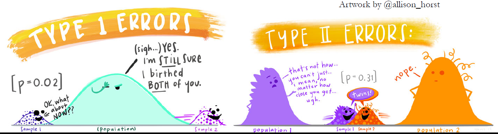
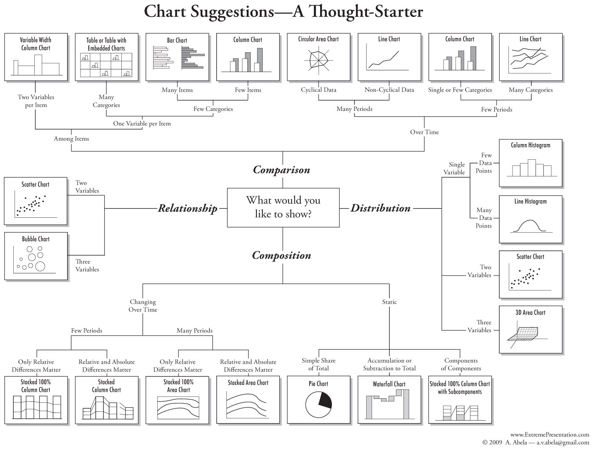

```{r setup, include=FALSE}
knitr::opts_chunk$set(echo = TRUE)
setwd("~/Eco636/Week 1")
```

###### Load packages
```{r, }
library(tidyverse)
```


### Why Data Exploration
We do data exploration to avoid type I and type II errors. Type I errors are when you find a significnat difference between samples but they are infact from the same population. Type II errors are when you do not have a significant different between samples when they actually come from different populations. 

```{r visual, echo=FALSE, out.width = '100%'}

```

### Rapid Fire visualizations
There are many types of visualizations we can do. Below is a chart to guide us. 
```{r chart, echo = FALSE, out.width = '90%'}

```

Lets do data exploration with Salamander data! 

```{r}
manders <- read.delim("salamander.txt")
# Here we used read.delim because it was a .txt file

head(manders)
```
We see that the data includes information about the season the observations were taken, the site they were found and other identifying features. 

Today we are focusing on Snout to Vent length (SVL), Total Length (TL) and sex. 

#### Boxplot
Boxplots are great for viewing the distribution of your data and to see if there are any potential outliers. When the data are relatively normally distributed, the median should be close to center in the box. 

The whiskers show the difference from the box to 1.5x the interquartile range, or the min or max, whichever comes first. The dots plotted outside that range are observations that should be checked as potential outliers. 

Looking at the plot below, they do not look super normally distributed with at least one observation that should be checked as a potential outlier. 
```{r}
boxplot(manders$TL, ylab = "Total Length (mm)")
title("Distribution of total salamander lengths")
```

Another common method for checking the distribution of residuals of the response variable is to use a Q-Q plot. 
The Q-Q plot plots the sample or actual observed quantiles of the response data on the y, with theoretical quantiles from a normal distribution on the x. Data that is normally distributed should form a straight diagonal line from the lower left of the plot to the upper right. 

In this plot, we see that there is a hump in the middle, showing that these data are likely not normally distributed. 
```{r}
qqnorm(manders$TL)
```

Another plot that is helpful is a conditional boxplot. Here we can compare the distributions of the observations within groups. That we we can look for homogeneity of variance across groups in the response variable. 

For example, here we are looking at total length by sex and we can see that the variance is not similar across groups. Thedistribution of the total lengths for salamanders without a knownn sex covers a much larger range. 
```{r}
boxplot(TL ~ Sex, data = manders,
        ylab = "Total length (mm)",
        col = c("#a6cee3", "#1f78b4", "#b2df8a"))
title("Distribution of total salamder lengths by sex")
```

We can also check the distribution of total length by sex and season and start to see that there are potential outliers in some of these groups. 
```{r}
boxplot(TL ~ Sex + Season, data = manders,
        ylab = "Total length (mm)",
        col = c("#a6cee3", "#1f78b4", "#b2df8a"))
title("Distribution of total salamander lengths by sex and season")
```

#### Outliers
The first thing about outliers is to first know and understand your data! This helps you identify if a point is an outlier due to an error somewhere in data collection or if it may actually reflect something of interest in your system. 

Outliers are observations that are considered extreme relative to the rest of the data and these points can disproportionately influence your analysis. 

You can use Cook's distance to help identify outliers based on how influential they are to your model. However just because a point is influential, does not mean that it is an outlier. But, if it is both a potential outlier through data visualization and also influential, it is probably a good idea to figure out if this point should stay in your data or not. 

You can compute the Cook's distance but you need to have defined your model to determine how influential each point is. 
Here we created a linear model where we tried predicting the total length based on the sex of the salamander and the season in which it was caught. We then plotted the Cook's D or the *measure of the nfuence of each observation on that model* with a red line represented 4 times the mean Cook's D, a widely used cut-off. 
```{r}
mod <- lm(TL ~ Sex * Season, data = manders)
cooksd <- cooks.distance(mod)
plot(cooksd, pch = 19, col = "blue")
abline(h=4*mean(cooksd, na.rm = TRUE), col = "red")
```

We see that there are many observations above the red but not all of these observations are considered potential outliers. 

#### Cleveland Dotplot
A cleveland dotplot is a good method for identifying potential outliers and homogeneity of variance 
```{r}
dotchart(manders$TL,
        ylab = "Row number",
        xlab = "TL range")
title("Total lenght of salamanders")
```

Ordering the dotplot by some explanatory variable can also help make potential outliers more obvious
```{r}
dotchart(manders$TL[order(manders$SVL)],
        ylab = "Snout-to-vent lenght rank",
        xlab = "TL range")
title("Total lenght of salamanders")
```

#### Scatterplots
To explore collinearity between variables a scatterplot is a great tool. Adding colors or shapes can help to plot different groups or categorical variables along with the continuous variables. 

```{r}
ggplot(data = manders, aes(x = SVL, y = TL, color = Sex)) + 
  geom_point()+
  labs(title = "Total length vs Snout to vent length",
       x = "Snout-to-vent lenght (mm)",
       y = "Total length (mm)")+ 
  scale_fill_manual(values = c("#a6cee3", "#1f78b4", "b2df8a")) + 
  theme_classic()
```

#### Pair Plots
A more useful method for creating scatterplots is to do a pair plot, where you plot the relationship between all variables in one quick and simple R line. 
Useful for:
* All Variables > 1
** Especially important for multivariate analyses (More than one response)
** For identifying collinearity issues
** For exploring relationships between response and explanatory variables. 

Lets try it! 

```{r}
# Puts histogram on the diagonal
panel.hist <- function(x, ...)
{
    usr <- par("usr"); on.exit(par(usr))
    par(usr = c(usr[1:2], 0, 1.5) )
    h <- hist(x, plot = FALSE)
    breaks <- h$breaks; nB <- length(breaks)
    y <- h$counts; y <- y/max(y)
    rect(breaks[-nB], 0, breaks[-1], y, col="white", ...)
}


## put (absolute) correlations on the upper panels with size proportional to the correlations. 
panel.cor <- function(x, y, digits = 2, prefix = "", cex.cor, ...)
{
  usr <- par("usr"); on.exit(par(usr))
  par(usr = c(0, 1, 0, 1))
  r <- abs(cor(x,y))
  txt <- format(c(r, 0.123456789), digits = digits)[1]
  txt <- paste0(prefix, txt)
  if(missing(cex.cor)) cex.cor <- 0.8/strwidth(txt)
  tect(0.5, 0.5, txt, cex = cex.cor * r)
}

pairs(manders[, c(1,2, 5:7)], diag.panel = panel.hist,
cex.labels = 2, font.labels = 2,
lower.panel = panel.smooth, upper.panel = panel.cor,
gap=0, row1attop=TRUE)
```

