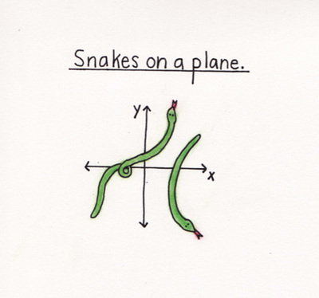

```{r setup, include=FALSE}
knitr::opts_chunk$set(echo = TRUE)
setwd("~/Eco-636/Week 4")
library(AICcmodavg) # For AIC
```
# Multiple Linear Regression
```{r meme, echo = FALSE, out.width = '45%', fig.align='center'}

```

Where we have multiple continuous explanatory variables

$$y_i = beta_0 + beta_1X_{1i} + beta_2X_{2i} + e_i $$
$beta_0$ is the intercept

$beta_1$ is the slope of the $X_1$ relationship

* The change in Yi with on eunit change in $X_1$ at *any* value of $X-2$ (*additive model*)

$beta_2$ is the slope of the $X_2$ relationship

* The chnage in Yi withone unit change in $X_2$ at *any* value of $X-1$ (*additive model*)

> The changes in Yi with the change in one explanatory variable while the other(s) held constant are often called: *marginal effects*

### Lets go through an example. --> Indigo Snakes
```{r read}
indigos <- read.table(file = "indigosMLR.txt", header = TRUE)

indigos$log.HR <- log(indigos$hr.size)
str(indigos)
```

We are interested in the variation in home range sizes of snakes (`hr.size`) based on what their home ranges are made up of. We log transformed the home range data (`log.HR`). Our proposed covariates are surround habitat structure (proportion). They are the proportion of a 1.5 km radius circle around the nesting site. 

* `Urban1.50`

* `Upland1.50`

* `Wetland1.50`

Recall the modeling process

~~~
Modeling Process: 

1. State the question/Hypothesis
    * What are the questions?
    * What are the variables?
  
2. Data Exploration

3. Describe the model 
    * In word form
    * In mathematical form
    * Identify the assumptions of the model
  
4. Fit the model

5. Evaluate the output
    * Model validation
    * Model Selection

6. Interpret the results
~~~

#### State the question/Hypothesis

Question: Does habitat compostion at the home range scale explain variation in home range size? 
    
$H_0$: There is no relationship between home range size and habitat composition

Variables:

* Response
    * Home range

* Explanatory:
    * Urban Percent
    * Upland percent
    * Wetland percent

#### Data Exploration
    
```{r}
panel.cor <- function(x, y, digits=1, prefix="", cex.cor)
{
    usr <- par("usr"); on.exit(par(usr))
    par(usr = c(0, 1, 0, 1))
    r1=cor(x,y,use="pairwise.complete.obs")
    r <- abs(cor(x, y,use="pairwise.complete.obs"))

    txt <- format(c(r1, 0.123456789), digits=digits)[1]
    txt <- paste(prefix, txt, sep="")
    if(missing(cex.cor)) cex <- 0.9/strwidth(txt)
    text(0.5, 0.5, txt, cex = cex * r)
}


panel.smooth<-function (x, y, col = "grey44", bg = NA, pch = 18, cex = 1, col.smooth = "red", span = 2/3, iter = 3, ...) 
{
  points(x, y, pch = pch, col = col, bg = bg, cex = cex)
  ok <- is.finite(x) & is.finite(y)
  if (any(ok)) 
    lines(stats::lowess(x[ok], y[ok], f = span, iter = iter), 
          col = col.smooth, ...)
}

pairs(indigos,
      upper.panel = panel.smooth, lower.panel = panel.cor)
```

#### Describe the Model

In Workds

* Does habitat compostion at the home range scale explain variation in home range size? 

As a mathematical model: 

$y_i$ = $beta_0 + beta_1X_{urbi}$ + $beta_2X_{upi} + beta_3X_{weti} + e_i$

$H_0$: $beta_1$ = 0, $beta_2$ = 0, $beta_3$ = 0

Assumptions?

* Residuals are normally distributed

* Constant variance (homogeneity)

* Observations are independent

* Predictors measured without error (fixed X)

#### Fit the Model 
```{r}
mG <- lm(log.HR ~ urban1.50 + upland1.50 + wetland1.50, data = indigos)

summary(mG)
```
We notice that the slope between percent urban in the home range and home range size is significantly negative. The other two variables do not seem to have a significant difference in home range size. 

#### Evaluate the output

Lets check the assumptions
```{r, fig.width=10}
par(mfrow = c(1,2))
plot(mG)
```
We look pretty good on our assumptions

Lets select our model. 

The other candidate models are: 

* Full (global) model: $y_i = beta_0 + beta_1X_{urbi} + beta_2X_{upi} + beta_3X_{weti} + e_i$

* Single Predictor models: 
    * $y_i = beta_0 + beta_1X_{urbi} + ei$
    * $y_i = beta_0 + beta_2X_{upi} + ei$
    * $y_i = beta_0 + beta_3X_{weti} + ei$

* Null Model: $y_i = beta_0 + e_i$

* Combination Models: 
    * $y_i = beta_0 + beta_1X_{urbi} + beta_2X_{upi} + ei$
    * $y_i = beta_0 + beta_1X_{urbi} + beta_3X_{weti} + ei$
    * $y_i = beta_0 + beta_2X_{upi} + beta_3X_{weti} + ei$


What may be the best model
```{r}
UrUpWe <- lm(log.HR ~ urban1.50 + upland1.50 + wetland1.50, data = indigos)
UrUp <- lm(log.HR ~ urban1.50 + upland1.50, data = indigos)
UrWe <- lm(log.HR ~ urban1.50 + wetland1.50, data = indigos)
UpWe <- lm(log.HR ~ upland1.50 + wetland1.50, data = indigos)
Ur <- lm(log.HR ~ urban1.50, data = indigos)
Up <- lm(log.HR ~ upland1.50, data = indigos)
We <- lm(log.HR ~ wetland1.50, data = indigos)
m0 <- lm(log.HR ~ 1, data = indigos)

## Put them to a fit list and use AIC
fitList <- list(
  UrUpWe = lm(log.HR ~ urban1.50 + upland1.50 + wetland1.50, data = indigos), 
UrUp = lm(log.HR ~ urban1.50 + upland1.50, data = indigos),
UrWe = lm(log.HR ~ urban1.50 + wetland1.50, data = indigos),
UpWe = lm(log.HR ~ upland1.50 + wetland1.50, data = indigos),
Ur = lm(log.HR ~ urban1.50, data = indigos),
Up = lm(log.HR ~ upland1.50, data = indigos),
We = lm(log.HR ~ wetland1.50, data = indigos),
m0 = lm(log.HR ~ 1, data = indigos)
)
(modtab <-  aictab(fitList))

```
Based on the results, our top model is Urban and Upland as explanatory variables. But we should also note that the full model is still within one delta AIC unit from the top model so its not too bad either. In our case, we can use any of the top three models. Lets check out the top model. 
#### Fitting and evaluating our best model 
Now that we chose the top model, we have to fit the model again. 
```{r fit}
summary(UrUp)
```
 We notice that the urban sites have a negative relationship with the home range size. It is significantly different. 
 
```{r eval}
par(mfrow = c(1,2))
plot(UrUp)
```


